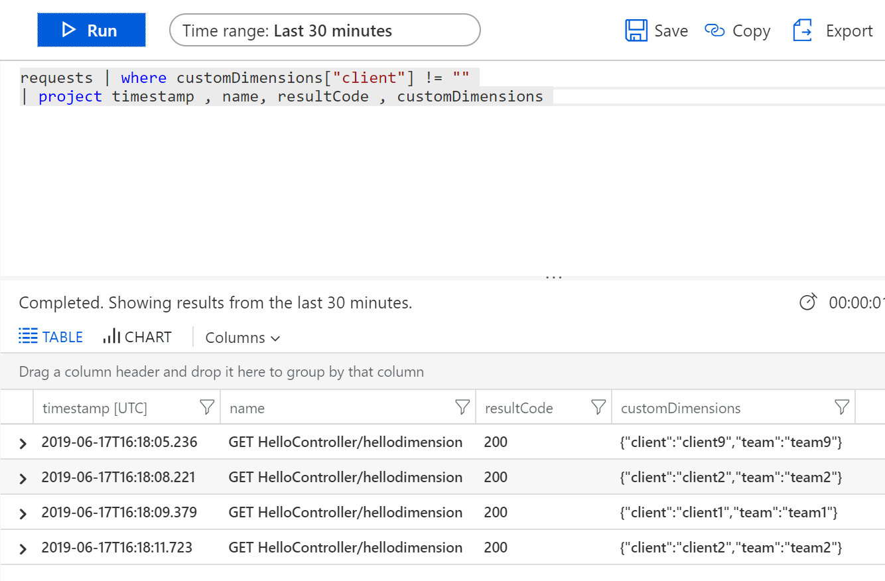
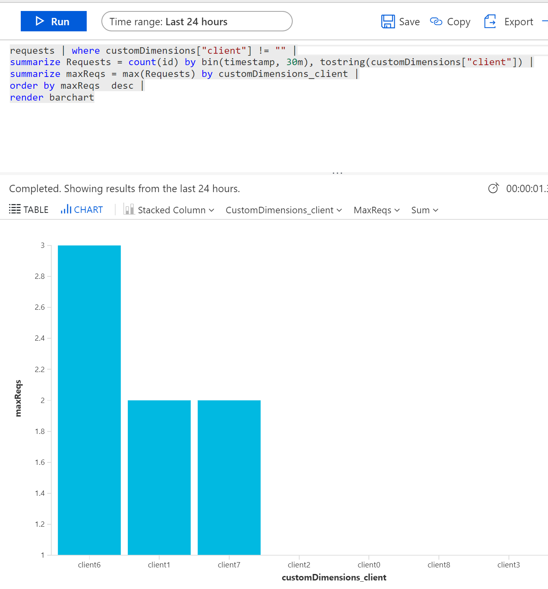
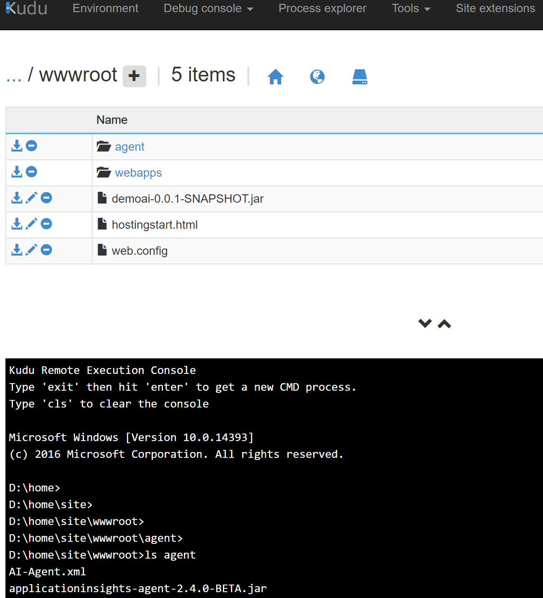
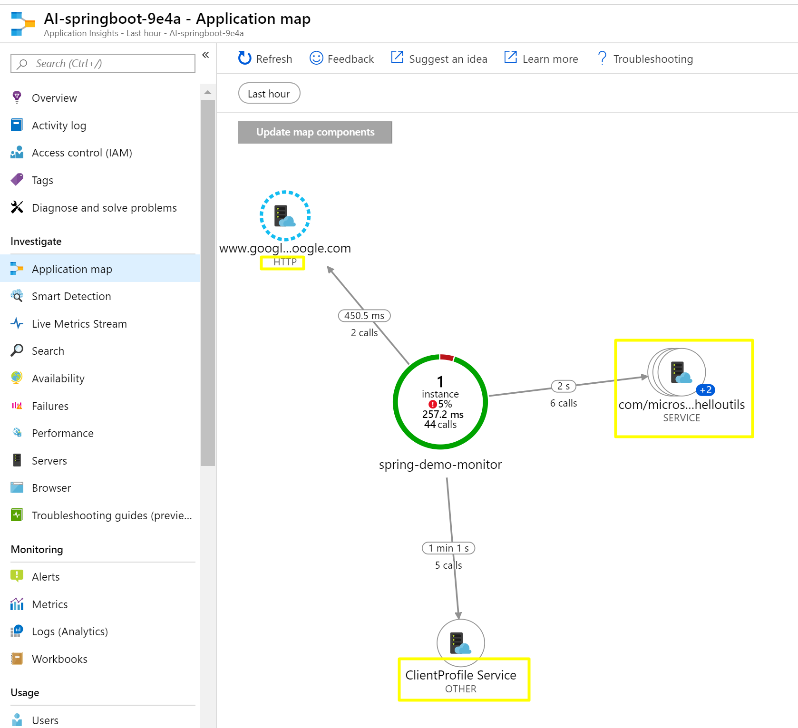
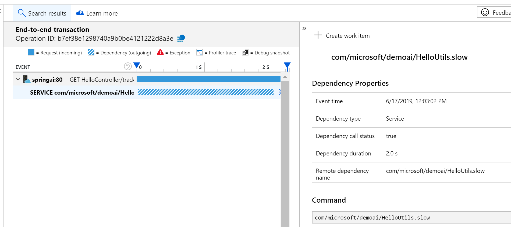
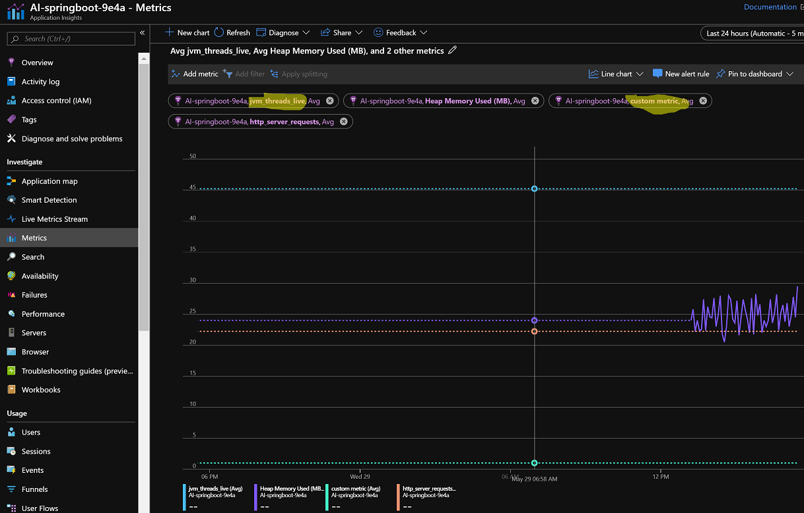
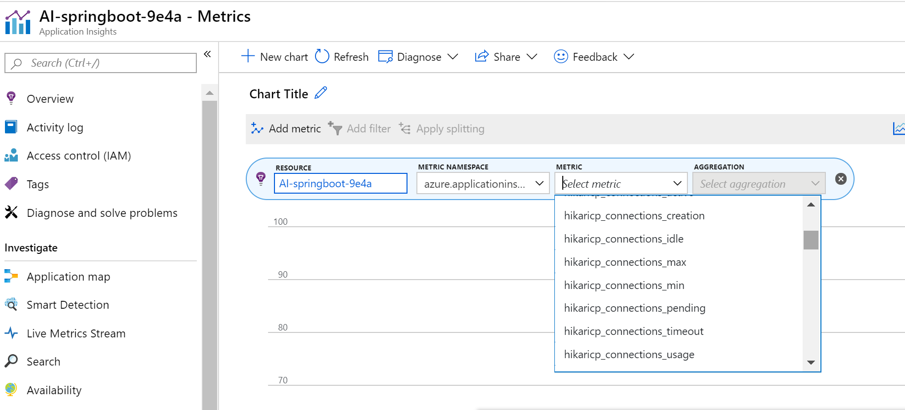

## Getting Started with SpringBoot Logging and App Insights on Azure AppService (Windows)

This repo has demonstrates using App Insights Logging Appenders for both `log4j` and `logback` logging frameworks.

### LogBack
- Add required libraries to enable integratiob with App Insights

```
<dependency>
    <groupId>com.microsoft.azure</groupId>
    <artifactId>applicationinsights-spring-boot-starter</artifactId>
    <version>1.1.2</version>
</dependency>
<dependency>
    <groupId>com.microsoft.azure</groupId>
    <artifactId>applicationinsights-logging-logback</artifactId>
    <version>2.3.1</version>
</dependency>
```

where `applicationinsights-spring-boot-starter` is enabling telemetry data to flow to AppInsights,
and `applicationinsights-logging-logback` is providing LogBack AppInsights appender.
Logback is default Logging framework for SpringBoot and is part of spring web starter.

- Add AI instrumentation keys to `application.properties` pointing to environment variable (it is available in Application Settings if AI was enabled for Web App)

```
azure.application-insights.instrumentation-key=${APPINSIGHTS_INSTRUMENTATIONKEY}
```

- Add AppInsights Appender to logback config , typically `logback-spring.xml` file under  `main\resources`
instrumentation key would be sourced from spring boot properties

```
<configuration scan="true">
    <include resource="org/springframework/boot/logging/logback/base.xml"/>

    <springProperty scope="context" name="INSTRUMENTATION_KEY"
                    source="azure.application-insights.instrumentation-key"/>

    <appender name="aiAppender"
              class="com.microsoft.applicationinsights.logback.ApplicationInsightsAppender">
        <instrumentationKey>${INSTRUMENTATION_KEY}</instrumentationKey>
    </appender>

    <root level="DEBUG">
        <appender-ref ref="aiAppender" />
        <appender-ref ref="FILE" />
        <appender-ref ref="CONSOLE" />
    </root>
</Configuration>    
```

- Add `web.config` that is used to start SpringBoot JAR in Azure App Service
Environment variable `logging.file` is used by default by `FILE` appender using by springboot default config

```
<?xml version="1.0" encoding="UTF-8"?>
<configuration>
  <system.webServer>
    <handlers>
      <remove name="httpPlatformHandlerMain" />
      <add name="httpPlatformHandlerMain" path="*" verb="*" modules="httpPlatformHandler" resourceType="Unspecified"/>
    </handlers>
    <httpPlatform processPath="%JAVA_HOME%\bin\java.exe"
            arguments="-Djava.net.preferIPv4Stack=true -Dserver.port=%HTTP_PLATFORM_PORT% -Dlogging.file=&quot;%HOME%\LogFiles\bootlogback.log&quot; -jar &quot;D:\home\site\wwwroot\demoai-0.0.1-SNAPSHOT.jar&quot;">
    </httpPlatform>
  </system.webServer>
</configuration>
```

### Log4J

Refer to `log4j` branch to see the config, it requires a bit more config comparing to logback

- add required libraries to `pom.xml`, exclude default Logback injected in spring starter and include log4j specific starter.
```
    <dependency>
        <groupId>org.springframework.boot</groupId>
        <artifactId>spring-boot-starter-web</artifactId>
        <exclusions>
        <exclusion>
            <groupId>org.springframework.boot</groupId>
            <artifactId>spring-boot-starter-logging</artifactId>
        </exclusion>
        </exclusions>	
	</dependency>
    <dependency>
        <groupId>org.springframework.boot</groupId>
        <artifactId>spring-boot-starter-log4j2</artifactId>
    </dependency>

    <dependency>
        <groupId>com.microsoft.azure</groupId>
        <artifactId>applicationinsights-spring-boot-starter</artifactId>
        <version>1.1.2</version>
    </dependency>
	
    <dependency>
        <groupId>com.microsoft.azure</groupId>
        <artifactId>applicationinsights-logging-log4j2</artifactId>
        <version>2.3.1</version>
    </dependency>
```

- where `applicationinsights-spring-boot-starter` is enabling telemetry data to flow to AppInsights,
and `applicationinsights-logging-log4j2` is providing Log4j AppInsights appender.

- Add AI instrumentation keys to `application.properties` pointing to environment variable (it is available in Application Settings if AI was enabled for Web App)

```
azure.application-insights.instrumentation-key=${APPINSIGHTS_INSTRUMENTATIONKEY}
```
- Add AppInsights Appender to Log4j2 config , typically `log4j2-spring.xml` file under  `main\resources`

```
<Configuration packages="com.microsoft.applicationinsights.log4j.v2">
  <Properties>
    <Property name="LOG_PATTERN">
      %d{yyyy-MM-dd HH:mm:ss.SSS} %5p ${hostName} --- [%15.15t] %-40.40c{1.} : %m%n%ex
    </Property>
  </Properties>
  <Appenders>
    <Console name="Console" target="SYSTEM_OUT">
      <PatternLayout pattern="%d{HH:mm:ss.SSS} [%t] %-5level %logger{36} - %msg%n"/>
    </Console>
    <ApplicationInsightsAppender name="aiAppender">
    </ApplicationInsightsAppender>
     <File name="MyFile" fileName="${sys:logging.file:-boot.log}">
      <PatternLayout>
        <Pattern>%d %p %c{1.} [%t] %m%n</Pattern>
      </PatternLayout>
    </File>
    <Async name="Async">
      <AppenderRef ref="MyFile"/>
    </Async>
  </Appenders>
  <Loggers>
    <Root level="info">
      <AppenderRef ref="Console"  />
      <AppenderRef ref="aiAppender"  />
      <AppenderRef ref="Async"  />
    </Root>
  </Loggers>
</Configuration>
```

- Use same `web.config` as described above, to make sure File output makes use of environment variable `logging.file` set  `fileName="${sys:logging.file:-boot.log}` for the appender as shown above.


## Deploy using Maven plugin

See `pom.xml` for setting up the latest plugin and run
`mvn clean package azure-webapp:deploy`

## App Insights integration
Spring starter App Insights integration allows to see basic performance metric for web controllers and send custom metrics and traces.

To use multiple dimensions with the metric pass `HashMap` of properties along with request to send Telemetry or metric

```java
int rand = new Random().nextInt(10);
// track custom dimension
RequestTelemetry telemetry = new RequestTelemetry();
telemetry.getProperties().put("team", "team" + rand);
telemetry.getProperties().put("client", "client" + rand);

telemetryClient.track(telemetry);
```

It will show up in metrics and logs 



- To query custom metrics use Kusto language to define aggregation by client dimension:

```
requests | where customDimensions["client"] != "" |
summarize Requests = count(id) by bin(timestamp, 30m), tostring(customDimensions["client"]) |
summarize maxReqs = max(Requests) by customDimensions_client |
order by maxReqs  desc |
render barchart
```



## App Insights Java agent integration
Azure App Insights agent allows you to capture automatically dependencies such as JDBC, HTTP calls and profile specific methods and exceptions. For the list of capabilities and configuration walkthrough to refer to [Java App Insights Agent Docs](https://docs.microsoft.com/en-us/azure/azure-monitor/app/java-agent)

It requires Java agent Jar file to be passed to application startup with `-javaagent=path to jar` options.
Agent also expects configuration file `AI-Agent.xml` to be in the same directory as the jar file.
For the format of config file refer to [AppInsights-Java Wiki](https://github.com/microsoft/ApplicationInsights-Java/wiki/AI-Agent.xml), which explains all the xml options and same github repo contains releases of the agent.

- To include agent modify `web.config` to pass `JAVA_OPTS`  that will pass java agent to the java process

```xml
<?xml version="1.0" encoding="UTF-8"?>
<configuration>
  <system.webServer>
    <handlers>
      <remove name="httpPlatformHandlerMain" />
      <add name="httpPlatformHandlerMain" path="*" verb="*" modules="httpPlatformHandler" resourceType="Unspecified"/>
    </handlers>
    <httpPlatform processPath="%JAVA_HOME%\bin\java.exe"
            arguments="%JAVA_OPTS% -Djava.net.preferIPv4Stack=true -Dserver.port=%HTTP_PLATFORM_PORT% -Dlogging.file=&quot;%HOME%\LogFiles\bootlogback.log&quot; -jar &quot;D:\home\site\wwwroot\demoai-0.0.1-SNAPSHOT.jar&quot; ">
    </httpPlatform>
  </system.webServer>
</configuration>
```

- Set Application Settings `JAVA_OPTS` to the full path of the agent (where it will be uploaded), in this example we set it in maven plugin in `pom.xml`

```xml
<appSettings>
  <property>
      <name>JAVA_OPTS</name>
      <value>-javaagent:D:\home\site\wwwroot\agent\applicationinsights-agent-2.4.0-BETA.jar</value>
  </property>
</appSettings>
```

- Set  maven plugin in `pom.xml` to upload the agent files to App Service

```xml
<resource>
  <!-- Where your artifacts are stored -->
  <directory>${project.basedir}/agent</directory>
  <!-- Relative path to /site/wwwroot/ -->
  <targetPath>agent</targetPath>
  <includes>
    <include>*</include>
  </includes>
</resource>
```

The resulting view in the file system:


### Profiling specific classes

To profile time execution of specific classes you have to list them in `AI-Agent.xml`, either on class level or down to method level

```
 <Class name="com.microsoft.demoai.HelloUtils" type="Service" enabled="true">
           <!--Method name="slow"
               reportCaughtExceptions="true"
               reportExecutionTime="true"
               />-->

           
  </Class>
```

As a result we will see the full Application Map with Dependencies and will be able to track exceptions and time executions:




## Add Springboot Micrometer Metrics

Micrometer application monitoring measures metrics for JVM-based application code and lets you export the data to Azure Monitor (and other monitoring systems).

- add metrics starter jar in pom.xml

```
<dependency> 
    <groupId>com.microsoft.azure</groupId>
    <artifactId>azure-spring-boot-metrics-starter</artifactId>
    <version>2.1.6</version>
</dependency>	
```


There are lots of default metrics exposed by various Spring components , see list here [Azure Monitor Micrometer](https://docs.microsoft.com/en-us/azure/azure-monitor/app/micrometer-java)


- Navigate to App Insights metrics and Add Metric from `azure.applicationinsights` namespace
See below Custom metric explicitly from HelloController  using `telemetryClient.trackMetric()` call



See below standard Spring Metrics


### @Timed annotation to send metrics to Azure Monitor

- You can use Spring `@Timed` annotation to explicitly

- add  dependency to pom.xml
```
    <dependency> 
        <groupId>com.microsoft.azure</groupId>
        <artifactId>azure-spring-boot-metrics-starter</artifactId>
        <version>2.1.6</version>
    </dependency>	
		<dependency>
			<groupId>org.springframework.boot</groupId>
			<artifactId>spring-boot-starter-actuator</artifactId>
		</dependency>
		<dependency>
			<groupId>org.springframework.boot</groupId>
			<artifactId>spring-boot-starter-aop</artifactId>
		</dependency>
```
- Add Configuration to register aspect


See below standard Spring Metrics


### Guides
The following guides illustrate how to use some features concretely:
* [Configure a Spring Boot Initializer app to use Application Insights](https://docs.microsoft.com/en-us/java/azure/spring-framework/configure-spring-boot-java-applicationinsights?view=azure-java-stable)

* [How to use Micrometer with Azure Monitor](https://docs.microsoft.com/en-us/azure/azure-monitor/app/micrometer-java)

* [Java App Insights Agent Docs](https://docs.microsoft.com/en-us/azure/azure-monitor/app/java-agent)

* [AppInsights-Java Wiki](https://github.com/microsoft/ApplicationInsights-Java/wiki/AI-Agent.xml)

